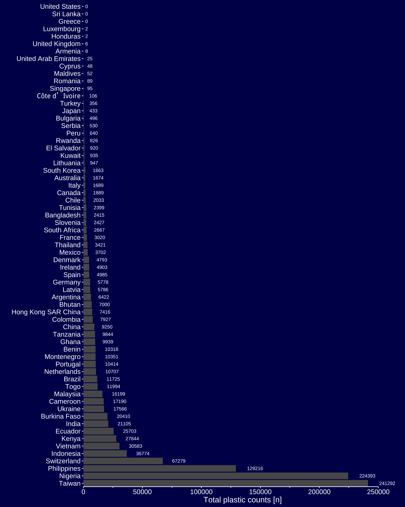

```{r setup, include=FALSE}
knitr::opts_chunk$set(echo = TRUE, comment = " ")
```

# Libraries

```{r libraries, cache = T, include=T, warning=FALSE, message=FALSE}
library(tidyverse) 
library(tidytuesdayR)
library(ggprism)
library(rmarkdown)
library(bookdown)
library(epuRate)
library(knitr)
library(citr)
library(emojifont)
library(countrycode)
```

# Data import

Using the `tidytuesdayR` package this task is easy:

```{r, message=FALSE, warning=FALSE, cache=TRUE, eval=FALSE}
data <-  tidytuesdayR::tt_load(2021, week = 5)
plastics <- data$plastics
```

```{r head, eval=FALSE, include=FALSE}
head(plastics)
```

# Total plastic counts per country

```{r plastics_country, warning=FALSE, message=FALSE, fig.height= 10, fig.width=10, dpi = 100, eval=FALSE}
plastics_country <- plastics %>%
  mutate(country = case_when(
    country == "ECUADOR" ~ "Ecuador",
    country == "NIGERIA" ~ "Nigeria",
    country == "United Kingdom of Great Britain & Northern Ireland" ~ "Ireland",
    TRUE ~ country
  )) %>%
  group_by(country) %>% 
  summarise(
    total = sum(grand_total)
  ) %>%
  arrange(desc(total)) %>%
  mutate(abbreviation = countrycode(country, "country.name", "cldr.name.en")) %>%
  mutate(flags = countrycode(country, "country.name", "unicode.symbol")) %>%
  filter(!country == "EMPTY") %>%
  mutate(total = ifelse(is.na(total), 0, total))
  # mutate(flags_2 = case_when(
  #   TRUE ~ emo::flag(abbreviation)
  #   )
  # )

head(plastics_country)

plastics_country %>%
  ggplot(aes(total, reorder(abbreviation, -total))) +
  geom_col() +
  geom_text(aes(label = total), size = 3, color = "white", hjust = -0.7) +
  labs(
    x = "Total plastic counts [n]",
    y = ""
  ) +
  eafithemer::theme_eafit_dark() +
  theme(
    legend.title = element_blank(),
    axis.line.x = element_line(color = "#FFFFFF"),
    axis.ticks = element_line(color = "#FFFFFF"),
    panel.grid = element_blank()
  ) +
  scale_x_continuous(guide = "prism_offset_minor", limits = c(0, 270000)) +
  coord_cartesian(expand = FALSE) +
  ggsave("plastics-total-01.png", width = 10, height = 12.5)

  
```



------------------------------------------------------------------------

<br><br>

::: {#disqus_thread}
:::

```{=html}
<script>

/**
*  RECOMMENDED CONFIGURATION VARIABLES: EDIT AND UNCOMMENT THE SECTION BELOW TO INSERT DYNAMIC VALUES FROM YOUR PLATFORM OR CMS.
*  LEARN WHY DEFINING THESE VARIABLES IS IMPORTANT: https://disqus.com/admin/universalcode/#configuration-variables*/
/*
var disqus_config = function () {
this.page.url = PAGE_URL;  // Replace PAGE_URL with your page's canonical URL variable
this.page.identifier = PAGE_IDENTIFIER; // Replace PAGE_IDENTIFIER with your page's unique identifier variable
};
*/
(function() { // DON'T EDIT BELOW THIS LINE
var d = document, s = d.createElement('script');
s.src = 'https://camilogarciabotero-github-io.disqus.com/embed.js';
s.setAttribute('data-timestamp', +new Date());
(d.head || d.body).appendChild(s);
})();
</script>
```
<noscript>

Please enable JavaScript to view the <a href="https://disqus.com/?ref_noscript">comments powered by Disqus.</a>

</noscript>

------------------------------------------------------------------------
