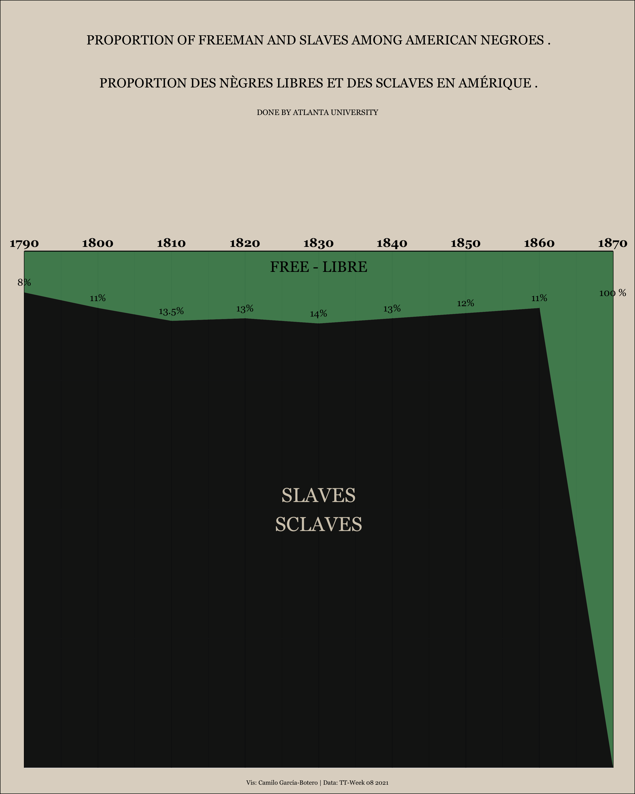

```{r setup, include=FALSE}
knitr::opts_chunk$set(echo = TRUE, comment = " ")
```

```{r libraries, cache = T, include=FALSE, warning=FALSE, message=FALSE}
library(tidyverse) 
library(tidytuesdayR)
library(ggprism)
library(rmarkdown)
library(bookdown)
library(epuRate)
library(knitr)
library(citr)
library(extrafont)
```

# Data import

Using the `tidytuesdayR` package this task is easy:

```{r, message=FALSE, warning=FALSE, cache=TRUE, eval=FALSE}
data <-  tidytuesdayR::tt_load(2021, week = 8)
freed_slaves <- data$freed_slaves

freed_slaves$Slave[freed_slaves$Year == 1800] <- 89 # There is a missing value in data
```

# Freed slaves over decades

```{r freed_slaves_p01, warning=FALSE, message=FALSE, fig.height= 10, fig.width=8, dpi = 100, eval=FALSE}

font <- "Georgia"

freed_slaves_long <- freed_slaves %>%
  pivot_longer(cols = c(Slave, Free), names_to = "Condition", values_to = "Proportion")

freed_slaves_long_filtered <- freed_slaves_long %>% 
    filter(Condition == "Free")

freed_slaves_long %>%
  ggplot(aes(Year, Proportion, fill = Condition)) +
  geom_area(data = freed_slaves_long, show.legend = FALSE, alpha = 0.98) +
  geom_text(data = freed_slaves_long_filtered %>% filter(Year != 1870), aes(label = paste0(Proportion, "%"), y = 102-Proportion), family = font) +
  annotate("text", label = "SLAVES\nSCLAVES", x = 1830, y = 50, size = 8, colour = "#D3CABA", family = font) +
  annotate("text", label = "FREE - LIBRE", x = 1830, y = 97, size = 6, colour = "#000000", family = font) +
  annotate("text",
    label = "100 %", x = 1870, y = 92,
    color = "#000000", size = 4, family = font
  ) +
scale_fill_manual(values = c("#4C885C", "#111312")) +
  labs(
    title = "PROPORTION OF FREEMAN AND SLAVES AMONG AMERICAN NEGROES .\n\n\nPROPORTION DES N??GRES LIBRES ET DES SCLAVES EN AM??RIQUE .",
    caption = "DONE BY ATLANTA UNIVERSITY",
    tag = "Vis: Camilo Garc??a-Botero | Data: TT-Week 08 2021"
  ) +
  theme_minimal() +
  theme(
    plot.title = element_text(hjust = 0.5, vjust = 50, size = 15, family = font),
    plot.caption = element_text(hjust = 0.5, vjust = 395, family = font),
    axis.text.x = element_text(color = "black", face = "bold", size = 14, family = font),
    plot.tag = element_text(size = 7, family = font),
    plot.caption.position = "plot",
    plot.tag.position = "bottom",
    panel.grid.major.x = element_line(color = "black"),
    panel.grid.minor.x = element_line(color = "black"),
    axis.line.x.top = element_line(color = "black"),
    axis.text.y = element_blank(),
    axis.title = element_blank(),
    plot.margin = margin(t = 200, r = 25, b = 10, l = 25),
    plot.background = element_rect(fill = "#DFD6CA")
  ) +
  scale_x_continuous(breaks = c(unique(freed_slaves$Year)), position= "top") +
  coord_cartesian(expand = FALSE, clip = "off") +
  ggsave("proporitions-plot-02.png", height = 12.5, width = 10, dpi = 300)


```



And the original piece: 


------------------------------------------------------------------------

<br><br>

::: {#disqus_thread}
:::

```{=html}
<script>

/**
*  RECOMMENDED CONFIGURATION VARIABLES: EDIT AND UNCOMMENT THE SECTION BELOW TO INSERT DYNAMIC VALUES FROM YOUR PLATFORM OR CMS.
*  LEARN WHY DEFINING THESE VARIABLES IS IMPORTANT: https://disqus.com/admin/universalcode/#configuration-variables*/
/*
var disqus_config = function () {
this.page.url = PAGE_URL;  // Replace PAGE_URL with your page's canonical URL variable
this.page.identifier = PAGE_IDENTIFIER; // Replace PAGE_IDENTIFIER with your page's unique identifier variable
};
*/
(function() { // DON'T EDIT BELOW THIS LINE
var d = document, s = d.createElement('script');
s.src = 'https://camilogarciabotero-github-io.disqus.com/embed.js';
s.setAttribute('data-timestamp', +new Date());
(d.head || d.body).appendChild(s);
})();
</script>
```
<noscript>

Please enable JavaScript to view the <a href="https://disqus.com/?ref_noscript">comments powered by Disqus.</a>

</noscript>

------------------------------------------------------------------------
